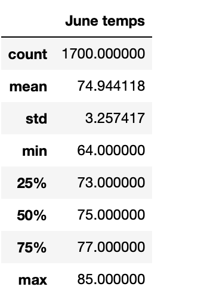
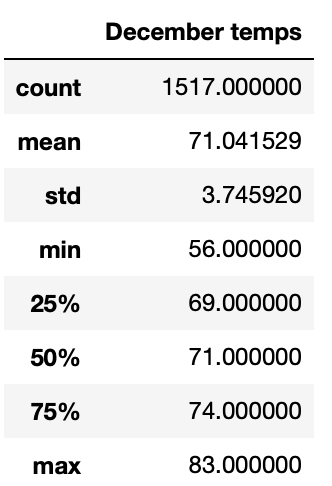

# surfs_up
Surf's up with Advanced Data Storage and Retrieval

## Overview of the Surfs Up Analysis
- The purpose of the Surfs Up Analysis was to operate and use advanced data storage and retrieval techniques to perform an analysis on a weather data set, provided by our client Wav. This project required the usage of a query tool such as SQLAlchemy to be able to examine the weather data, a SQLite database, to perform and combine statistical analysis with dataframe analysis. Using SQLite with its local database features, which provides fast data queried by SQLAlchemy, allowed for the necessary information to provide to our client Wav. This weather analysis would help determine if opening a Surf n'Shake shop in Oahu would be a viable venture.

## Results

**Three Key differences from the weather analysis of Oahu in the months of June and December**

 1. The mean temperature of June, according to the image above, shows that Oahu has an average temperature of 75 degrees during the month of June. Likewise, the mean temperature of Oahu during the month of December was a slightly cooler 71 degrees. The mean temperatures are calculated by adding all the temperatures specifically in the dataset, and dividing by the number of entries. In our case, the datasets are queried into a dataframe for the months of June and Decemeber. 
 
 2. From the dataset of the month of June in Oahu, we are able to observe that the highest recorded temperature is 85 degrees. Contrary to the June dataset, the highest temperature in Oahu during the month of December was 83 degrees. The highest temperature was determined by examining the max index in the datasets, the max index identifies the largest number in a dataset. 
 
 3. From the dataset of the month June in Oahu, we are able to observe that the lowest recorded temperature is 64 degrees. Contrary to the June dataset, the lowest temperature in Oahu during the month of December was 56 degrees. The lowest temperature was determined by examining the min index in the datasets, the min index identifies smallest number in a dataset. 
 
## Summary of the Surfs Up Analysis
 - In conclusion of the Surfs Up analysis, based on the weather analysis results that provided the June and December datasets, one can propose that the weather year round in Oahu is optimal in supporting a franchise Surf n'Shake shop. The weather temperatures collected by the weather analysis showcase prime beach weather year round with the winter season during December having a an average temperature of 71 degrees and the lowest temperature recording being at 56 degrees. Slightly chilly but on a sunny day, cool temperatures. This brings me to my suggestions of adding addtional queries to perform and gather more weather data for the months of June and December. These query suggestions include 
   1. Including weather descriptions in the data analysis, which pertains to collecting descriptions of when there were sunny days, cloudy days, rainy days. Doing so would provide an ideal analysis of the type of weather conditions experienced in Oahu during the months of June and December, and whether that would effect the project.
   2. Including precipiation query that collects how often it rains on the island of Oahu during the months of June and Decemeber would be a very important dataset to examine for the project. Understanding how rain factors into whether our Surf n'Shake will thrive, based on how rainy seasons will affect the amount of people coming to the island in the months of June and December, is a great query to better understand the correlation between travelers and the factor of weather. 
 
